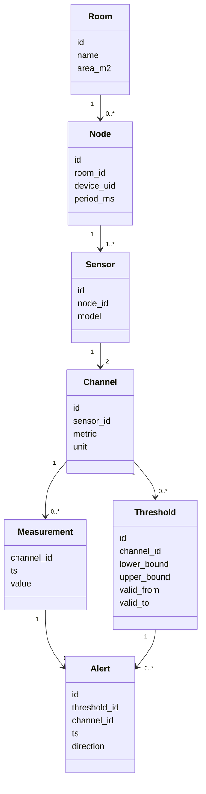

```mermaid
classDiagram
    direction TB
    Room "1" --> "0..*" Node
    Node "1" --> "1..*" Sensor
    Sensor "1" --> "2" Channel
    Channel "1" --> "0..*" Measurement
    Channel "1" --> "0..*" Threshold
    Measurement "1" --> "0..1" Alert
    Threshold "1" --> "0..*" Alert
    class Room {
        id
        name
        area_m2
    }
    class Node {
        id
        room_id
        device_uid
        period_ms
    }
    class Sensor {
        id
        node_id
        model
    }
    class Channel {
        id
        sensor_id
        metric
        unit
    }
    class Measurement {
        channel_id
        ts
        value
    }
    class Threshold {
        id
        channel_id
        lower_bound
        upper_bound
        valid_from
        valid_to
    }
    class Alert {
        id
        threshold_id
        channel_id
        ts
        direction
    }
```
